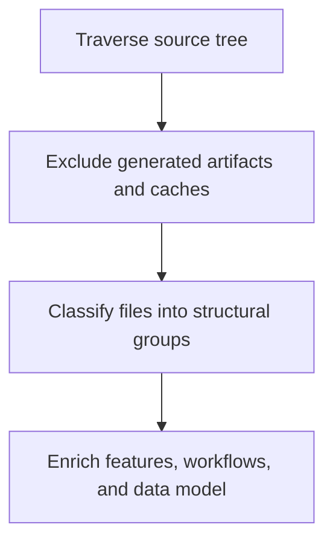

# Project Scan Enrichment

> Deep project scan that classifies source structure and enriches feature, workflow, and data-model seeds from real source areas.

**Trigger:** scan_project invocation  
**Source files:** src/tools/scan-project.ts, src/tools/scanner-artifact-policy.ts, src/tools/structural-generators.ts  

## Flowchart

## Steps

### 1. Traverse source tree

### 2. Exclude generated artifacts and caches

### 3. Classify files into structural groups

### 4. Enrich features, workflows, and data model

