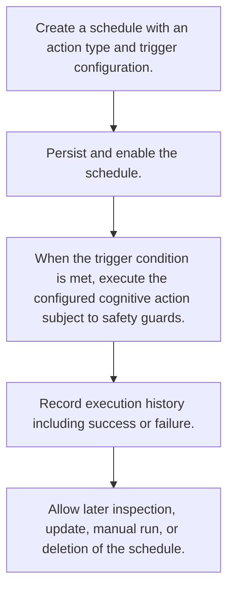

# Scheduled Cognitive Execution

> Auto-generated primary workflow doc. Canonical structured source: data/workflows.json.

> Automates recurring cognitive actions like dream cycles, nightmare scans, metacognitive analysis, and narrative updates according to temporal triggers.

**Trigger:** schedule trigger condition met  
**Source files:** src/cognitive/scheduler.ts, src/cognitive/register.ts  

## Flowchart

## Steps

### 1. Create a schedule with an action type and trigger configuration.

Define the recurring cognitive action together with the timing or event trigger that should fire it.

### 2. Persist and enable the schedule.

Store the schedule so it survives process restarts and becomes eligible for execution.

### 3. When the trigger condition is met, execute the configured cognitive action subject to safety guards.

Run the scheduled cognitive operation only when timing and safety conditions allow it.

### 4. Record execution history including success or failure.

Capture an audit trail of each scheduled run and whether it completed successfully.

### 5. Allow later inspection, update, manual run, or deletion of the schedule.

Support ongoing management of the scheduled cognitive action after creation.

