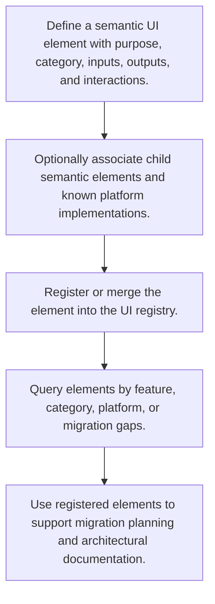

# Semantic UI Registration Flow

> Auto-generated primary workflow doc. Canonical structured source: data/workflows.json.

> Captures semantic UI elements, their data contracts, interaction model, and platform implementations so interface concepts can be queried and migrated independently of rendering technology.

**Trigger:** semantic UI registration request  
**Source files:** src/tools/ui-registry.ts  

## Flowchart

## Steps

### 1. Define a semantic UI element with purpose, category, inputs, outputs, and interactions.

Describe the UI concept independently of any concrete rendering technology.

### 2. Optionally associate child semantic elements and known platform implementations.

Capture composition relationships and any current implementations across platforms.

### 3. Register or merge the element into the UI registry.

Persist the semantic element so it becomes part of the shared UI knowledge base.

### 4. Query elements by feature, category, platform, or migration gaps.

Retrieve registered UI concepts to support search, inspection, and migration analysis.

### 5. Use registered elements to support migration planning and architectural documentation.

Apply registry knowledge to broader UI planning and documentation workflows.

