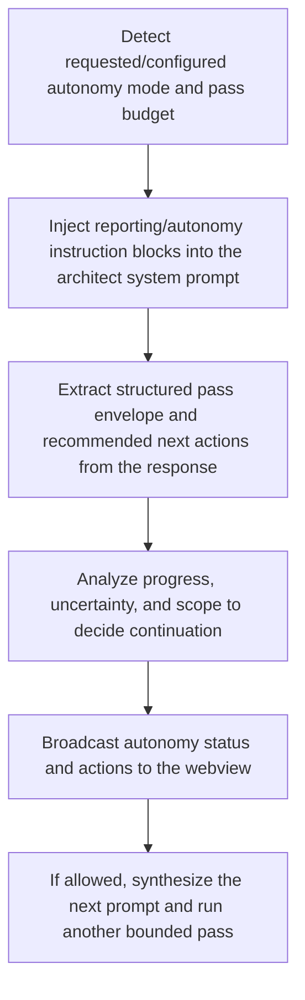

# VS Code Autonomy Continuation Loop

> After each architect pass, the extension extracts the structured pass envelope, derives recommended actions, analyzes continuation safety against autonomy mode and pass budget, updates visible autonomy status, and may self-continue with a synthesized next prompt until the goal is reached, risk rises, or the budget is exhausted.

**Trigger:** assistant pass completion in the VS Code architect chat panel  
**Source files:** extensions/vscode/src/chat-panel.ts, extensions/vscode/src/autonomy-loop.ts, extensions/vscode/src/autonomy-structured.ts, extensions/vscode/src/autonomy.ts, extensions/vscode/src/reporting.ts  

## Flowchart

## Steps

### 1. Detect requested/configured autonomy mode and pass budget

### 2. Inject reporting/autonomy instruction blocks into the architect system prompt

### 3. Extract structured pass envelope and recommended next actions from the response

### 4. Analyze progress, uncertainty, and scope to decide continuation

### 5. Broadcast autonomy status and actions to the webview

### 6. If allowed, synthesize the next prompt and run another bounded pass

