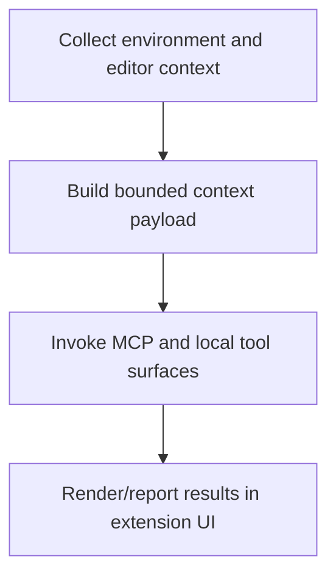

# VS Code Chat Context Loop

> Extension workflow that gathers editor and project context, routes through MCP/local tools, and reports results through the chat panel and reporting surfaces.

**Trigger:** chat request in extension  
**Source files:** extensions/vscode/src/chat-panel.ts, extensions/vscode/src/context-builder.ts, extensions/vscode/src/mcp-client.ts, extensions/vscode/src/reporting.ts, extensions/vscode/src/task-reporter.ts  

## Flowchart

## Steps

### 1. Collect environment and editor context

### 2. Build bounded context payload

### 3. Invoke MCP and local tool surfaces

### 4. Render/report results in extension UI

